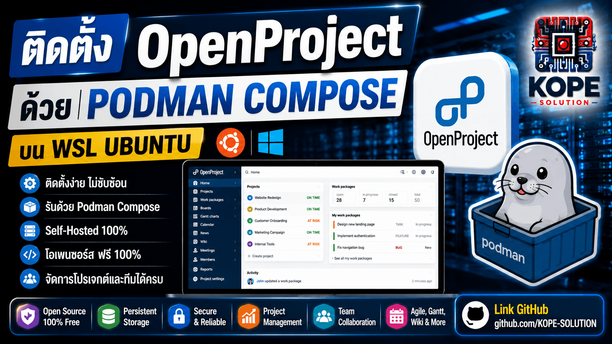

# OpenProject on Podman + WSL Ubuntu 🚀



ติดตั้ง OpenProject บน WSL Ubuntu ด้วย Podman Compose สำหรับสร้างระบบ Project Management แบบ Self-Hosted

เหมาะสำหรับ:
- Developer
- DevOps Engineer
- IoT Engineer
- Engineering Team
- R&D Team
- Homelab
- Open Source Infrastructure

---

# 📦 Environment
- Windows 10/11
- WSL2
- Ubuntu 24.04 LTS
- Podman
- Podman Compose

---

# 🧠 What is OpenProject?

OpenProject คือระบบ Open Source Project Management สำหรับ:
- Task Management
- Kanban Board
- Agile / Scrum
- Gantt Chart
- Wiki
- Time Tracking
- Team Collaboration

<br>

สามารถใช้งานแทน:
- Jira
- Trello
- Asana
- Monday
- ClickUp

---

# 🛠️ Install Podman

อัปเดตแพ็กเกจ:

```bash
sudo apt update && sudo apt upgrade -y
```

<br>

ติดตั้ง Podman:

```bash
sudo apt install -y podman
```

<br>

ตรวจสอบเวอร์ชัน:

```bash
podman --version
```

---

# 🛠️ Install Podman Compose

ติดตั้ง:

```bash
sudo apt install -y podman-compose
```

<br>

ตรวจสอบ:

```bash
podman-compose version
```

---

# 📁 Create Project Directory

สร้างโฟลเดอร์โปรเจกต์:

```bash
mkdir -p ~/openproject
cd ~/openproject
```

---

# 📄 Create compose.yaml

สร้างไฟล์:

```bash
nano compose.yaml
```

<br>

วางเนื้อหาดังนี้:

```yaml
services:
  openproject:
    image: docker.io/openproject/openproject:16

    container_name: openproject

    restart: unless-stopped

    ports:
      - "8080:80"

    environment:
      OPENPROJECT_SECRET_KEY_BASE: "replace-this-with-random-secret"
      OPENPROJECT_HTTPS: "false"
      OPENPROJECT_HOST__NAME: "localhost:8080"

    volumes:
      - openproject_pgdata:/var/openproject/pgdata
      - openproject_assets:/var/openproject/assets

volumes:
  openproject_pgdata:
  openproject_assets:
```

---

# 🔐 Generate Secret Key (Recommended)

สร้าง Secret Key แบบสุ่ม:

```bash
openssl rand -hex 32
```

<br>

ตัวอย่าง:

```text
9d1a8a87a9c8479fddcbeb2b28c68d73d91d2c0ab2df9c2f9a47b9f9fd11eabc
```

<br>

นำไปแทนค่า:

```yaml
OPENPROJECT_SECRET_KEY_BASE
```

---

# 🚀 Start OpenProject

รัน Container:

```bash
podman-compose up -d
```

---

# 📋 Check Running Containers

```bash
podman ps
```

---

# 🌐 Access OpenProject

เปิด Browser:

```text
http://localhost:8080
```

<br>

หรือบน Windows Browser:

```text
http://127.0.0.1:8080
```

---

# ⏳ First Startup

การเปิดครั้งแรก:

- ระบบจะ Initialize Database
- ใช้เวลาประมาณ 2-5 นาที
- จากนั้นจะเข้าสู่หน้า Create Administrator

---

# 👤 Create Administrator

สร้างบัญชี Admin สำหรับเข้าใช้งานครั้งแรก:
- Username
- Password
- Email

---

# 📜 View Logs

ดู Logs แบบ Real-time:

```bash
podman logs -f openproject
```

---

# 🔄 Restart Container

```bash
podman restart openproject
```

---

# 🛑 Stop Container

```bash
podman-compose down
```

---

# 🔥 Update OpenProject

ดึง Image ใหม่:

```bash
podman pull docker.io/openproject/openproject:16
```

Restart Service:

```bash
podman-compose down
podman-compose up -d
```

---

# 💾 Persistent Storage

ข้อมูลทั้งหมดจะถูกเก็บใน Named Volumes:

- openproject_pgdata
- openproject_assets

แม้ลบ Container ข้อมูลจะยังอยู่

---

# ⚠️ Remove Everything

ลบ Container + Volumes ทั้งหมด:

```bash
podman-compose down -v
```

---

# 🔍 Useful Commands

## ดู Containers

```bash
podman ps -a
```

---

## ดู Images

```bash
podman images
```

---

## ดู Volumes

```bash
podman volume ls
```

---

## ดู Resource Usage

```bash
podman stats
```

---

# 🧪 Troubleshooting

## Port 8080 Already in Use

ตรวจสอบ Port:

```bash
sudo ss -tulpn | grep 8080
```

เปลี่ยน Port ใน compose.yaml:

```yaml
ports:
  - "9090:80"
```

เข้าใช้งาน:

```text
http://localhost:9090
```

---

# 🐧 WSL Notes

ตรวจสอบ WSL Version:

```bash
wsl --version
```

ตรวจสอบ Ubuntu:

```bash
lsb_release -a
```

---

# 📹 YouTube Video Ideas

- OpenProject Installation
- Podman vs Docker
- Self-Hosted Project Management
- Jira Alternative
- DevOps Homelab
- Open Source Infrastructure

---

# 🚀 Next Episode

หลังติดตั้งเสร็จ สามารถต่อยอดไปยัง:

- Project Management
- Work Package
- Kanban Board
- Agile / Scrum
- Gantt Chart
- Team Workflow
- OpenProject API

---

# 👨‍💻 Author

KOPE-SOLUTION

GitHub:
https://github.com/KOPE-SOLUTION
